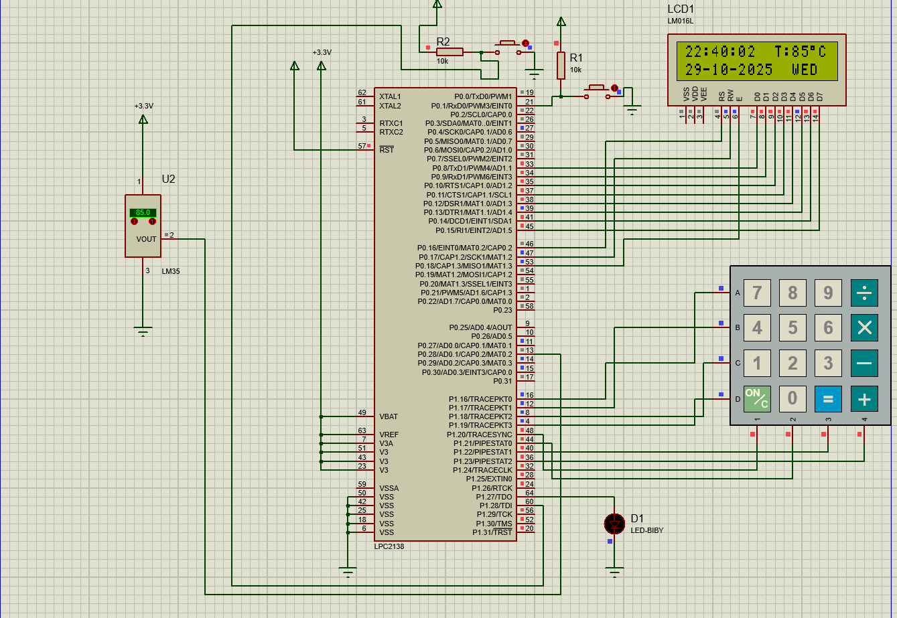

# ENVIRONCLOCK ⏰🌡️

An embedded systems mini project that combines a real-time clock, temperature sensing, alarm functionality, and buzzer — all displayed on an LCD with smooth scrolling animations.

---

## 🌟 Features
- Displays real-time clock (Hours, Minutes, Seconds)
- Displays Date (DD/MM/YEAR)
- Shows real-time temperature using LM35 sensor
- Set Alarm option with LCD text scrolling animation
- Custom degree Celsius (°C) symbol display
- Alarm buzzer when set time is reached
- Uses **ADC** to read temperature sensor data
- Implements **Interrupts** for accurate RTC timing and key response

---

## ⚙️ Tools & Components
- **Microcontroller:** LPC2148 / 8051 / AVR  
- **LCD Display:** 16x2 character LCD  
- **RTC Module:** DS1307 or equivalent  
- **Temperature Sensor:** LM35  
- **Buzzer:** for alarm indication  
- **Software Tools:** Embedded C, Keil IDE, Proteus Simulation

---

## 🧠 Working Principle
1. The **RTC module** provides real-time data (hours, minutes, seconds, date).  
2. The **LM35 sensor** measures ambient temperature; analog output is converted to digital using **ADC**.  
3. The **LCD** continuously displays the time, date, and temperature with smooth transitions.  
4. The **alarm function** allows setting a custom time; a buzzer activates when matched.  
5. **Interrupts** ensure precise timekeeping and responsive key scanning.

---

## 🖥️ Circuit Diagram

Below is the Proteus circuit diagram used in this project:

**Explanation:**
- LPC2148 microcontroller connected with RTC and LM35 sensor.  
- LCD (16x2) displays clock, date, and temperature values.  
- Buzzer is triggered when alarm time matches real-time clock.  
- ADC channel reads LM35 output voltage.  
- Interrupts from RTC and keypad ensure accurate timekeeping and user input.

---

## 🧰 Software Used
- **Keil µVision IDE** – for Embedded C code development  
- **Proteus 8 Professional** – for circuit design and simulation  
- **Flash Magic** – for LPC2148 programming  

---

## 👨‍💻 Author
**Naveen Gandla**

📍 *Embedded Systems Engineer in training*  
💡 Passionate about real-time embedded applications and hardware–software integration.

---
